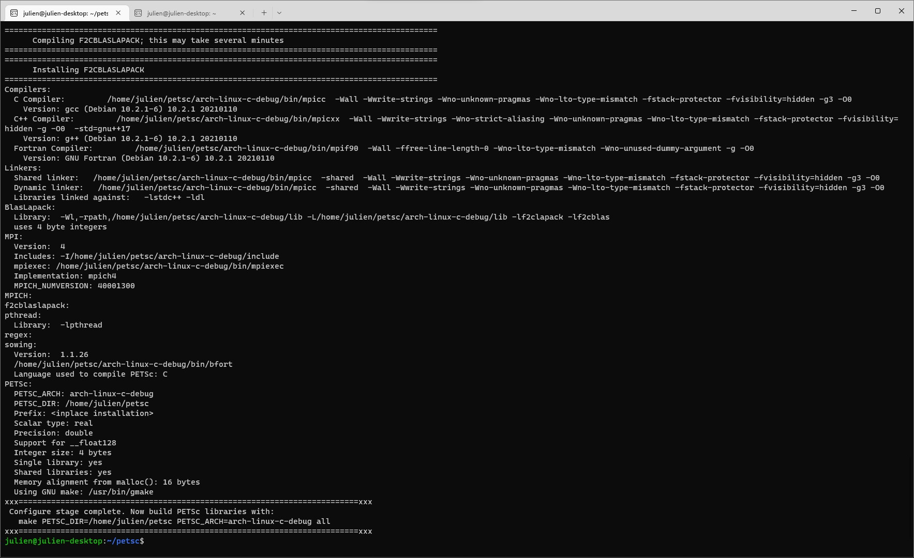
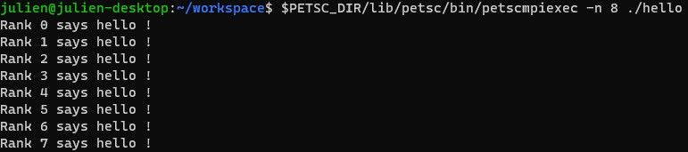

- [Installation on a...](#installation-on-a)
  - [... *Debian-based* distribution](#-debian-based-distribution)

# Installation on a...

## ... *Debian-based* distribution

First, one must install some dependencies. Open your *Linux* terminal and start typing

```bash
sudo apt-get install --yes g++ gcc gfortran git libblas-dev liblapack-dev python3 python3-pip python3-dev
```

Then, check the installation with the following command

```bash
printf '#include<stdio.h>\nint main(){printf("cc OK!\\n");}' > t.c && cc t.c && ./a.out && rm -f t.c a.out
```

`cc OK!` should appear in the console. Prerequisites are ready. Then, create a folder with `mkdir ~/<folder name>` and clone the stable release of *PETSc* with `git clone -b release https://gitlab.com/petsc/petsc`. Go to the folder : `cd petsc` and configure the package with

```bash
./configure --with-cc=gcc --with-cxx=g++ --with-fc=gfortran --download-f2cblaslapack --download-mpich
```

If this step is a success. An example of result is



Build the library with a command like

```bash
make PETSC_DIR=/home/julien/petsc PETSC_ARCH=arch-linux-c-debug all
```

Check the installation with

```bash
make PETSC_DIR=/home/julien/petsc PETSC_ARCH=arch-linux-c-debug check
```

The script `helloPETSc.c` gives, with the makefile `$PETSC_DIR/src/snes/tutorials/makefile`,

